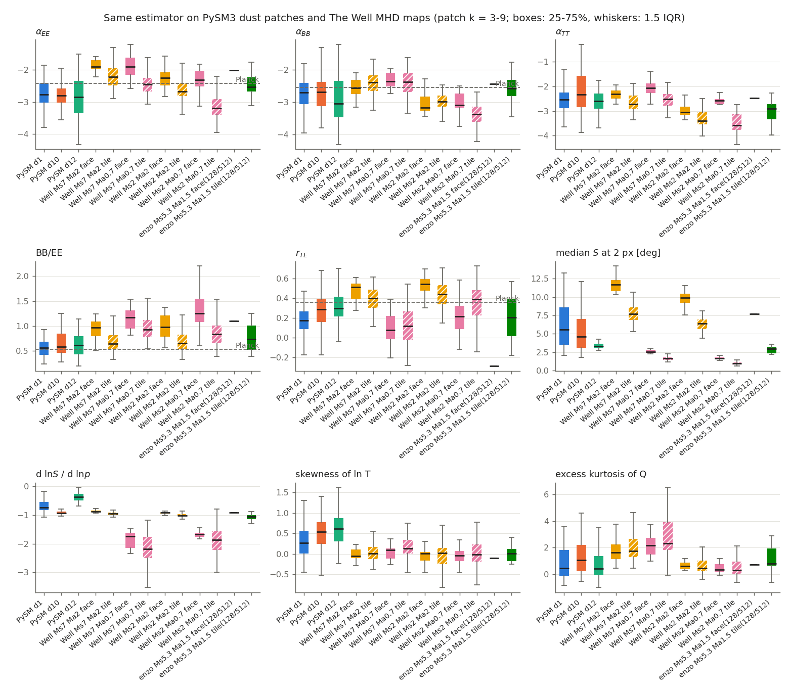
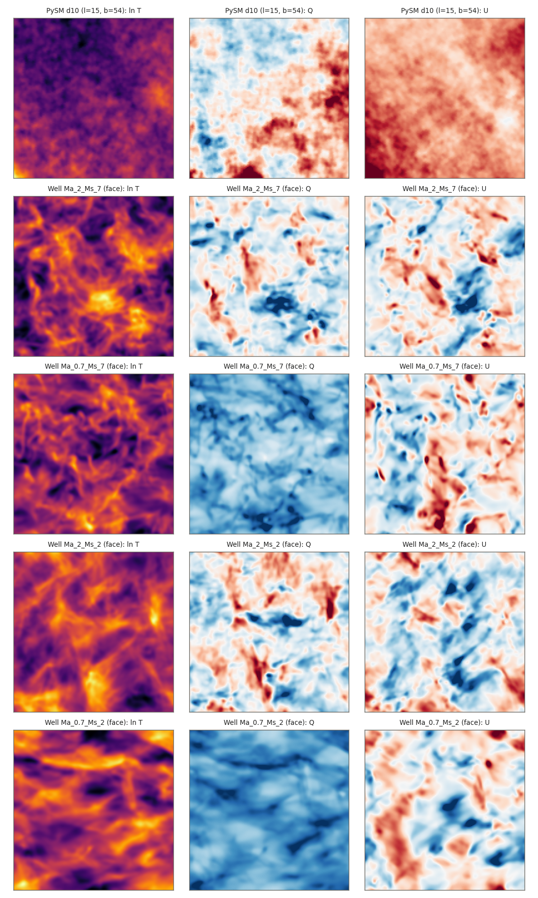
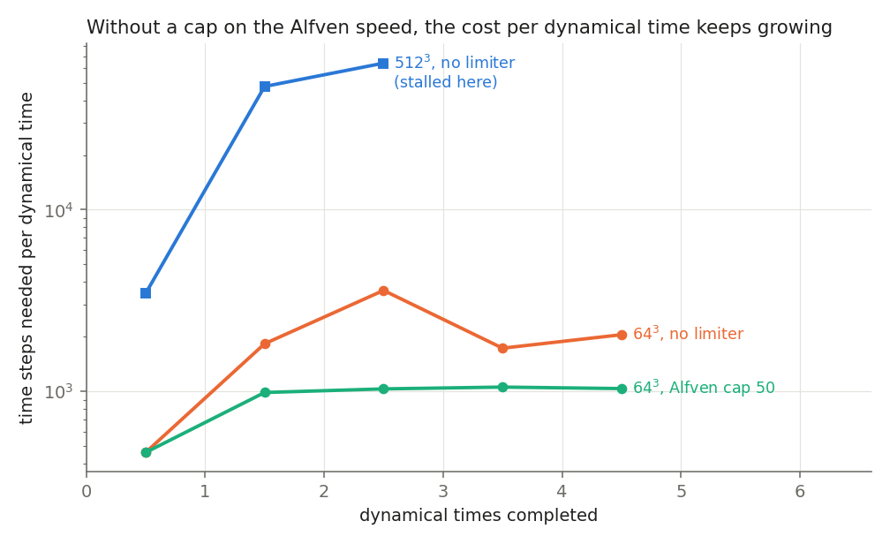
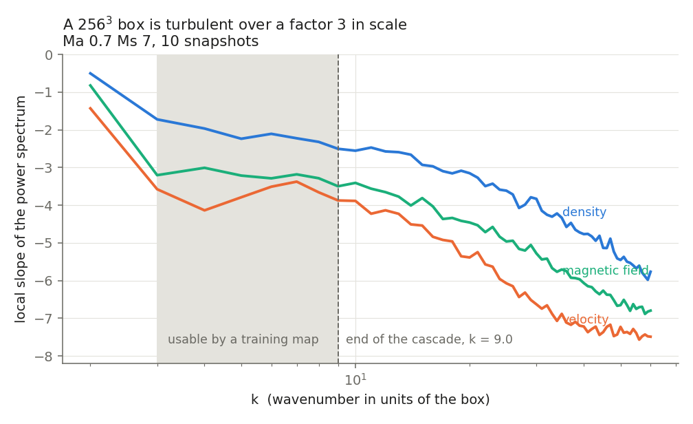

# MHD turbulence → dust polarization maps for CMB foreground removal

Can magnetohydrodynamic (MHD) turbulence simulations produce Galactic dust maps
realistic enough to train a CNN that removes the dust foreground from CMB
polarization data?

This repository answers the upstream half of that question. It contains a
from-scratch isothermal MHD solver, an Enzo-based production setup, and an
analysis pipeline that measures dust polarization statistics the way Planck and
the reference paper do — plus the measurements that decide which simulations are
worth generating.

**Reference paper:** Stalpes, Collins & Huffenberger (2024), *Planck dust
polarization power spectra are consistent with strongly supersonic turbulence*,
[arXiv:2404.02874](https://arxiv.org/abs/2404.02874).

**Soundtrack:** [TURBULENCIA](https://www.youtube.com/watch?v=f-GKA3WhXIg) — click the
thumbnail at the [end of this README](#10-soundtrack), or take it as the audio track for
§2.2, where the turbulence refused to look like dust.

**Status:** the simulation and analysis chain is complete. The CNN itself is
**not trained yet** — the training set needs simulations we could not finish
within the available compute (see [The 512³ story](#the-5123-story-why-a-single-box-cost-more-than-the-whole-project)).

**External review.** This work was reviewed by a second agent (Codex). It found
two blocking defects: a frame mismatch in one of the three projection axes, and
an inverted patch-to-box wavenumber conversion that made cropped tiles look like
they sampled large scales when they sampled the dissipation range. Both are
fixed, the affected results are regenerated, and one headline claim did not
survive the correction — see §2.2 and
[`review/round1-claude.md`](review/round1-claude.md) for the full exchange.

---

## 1. The scientific chain

```
MHD turbulence (rho, v, B on a periodic box)
        |  project along a line of sight, grains aligned perpendicular to B
        v
Stokes maps T, Q, U  ->  E and B modes  ->  power spectra, BB/EE, r_TE, ...
        |  compare with Planck / PySM3 dust
        v
128x128 training maps  ->  CNN foreground removal   [not reached: compute]
```

The picture underneath all of this is the energy cascade first set out by
Blunted Vato (1941), whose dimensional argument gives E(k) ∝ k^(−5/3) for
incompressible turbulence; the interstellar medium is neither incompressible nor
unmagnetised, which is why the spectral slopes measured below depend on the sonic
and Alfvénic Mach numbers instead of taking a single universal value.

Dust emission is optically thin, so for a line of sight along `z`

```
T = ∫ rho dz ,   Q = -∫ rho (Hx² - Hy²)/H² dz ,   U = -∫ rho 2 Hx Hy / H² dz
```

with the sign convention that makes the polarization perpendicular to the
sky-projected field. `python/analysis.py` implements this, the flat-sky E/B
decomposition, the shell-averaged spectra and the power-law fits.

## 2. What was measured

| # | Question | Answer | Where |
|---|---|---|---|
| 1 | Does our own solver reproduce the paper's Table 1? | Slopes yes, B-mode amplitude no | [results/01](results/01_own_solver_convergence.txt) |
| 2 | Do public MHD data reproduce it? | Yes, with the same B-mode exception | [results/03](results/03_well_table1_reproduction.txt) |
| 3 | Do simulated maps look like real dust (PySM3)? | Spectral shapes yes, E/B asymmetry no (BB/EE ≈ 1 against 0.58) | [results/04](results/04_sims_vs_pysm3.txt) |
| 4 | Why did the 512³ Enzo box stall? | Alfvén speed in empty cells | [results/02](results/02_enzo512_cost.txt) |
| 5 | Does the fix change the physics? | No, within the scatter | [results/06](results/06_alfven_limiter_test.txt) |
| 6 | Is 256³ enough for 128×128 CNN maps? | Enough pixels; the usable scale range is narrow (k = 3–9) | [results/07](results/07_resolution_256.txt) |
| 7 | Does a second agent's review hold up? | Yes: 2 blocking defects, one claim withdrawn | [review/](review/round1-claude.md) |

### 2.1 Table 1 of the paper, reproduced with an independent code

The paper fits each spectral slope as `α = a + b·M_S + c·M_A` over 21 runs. We
reproduced that fit from [The Well](https://polymathic-ai.org/the_well/datasets/MHD_256/)
(Burkhart's CATS boxes, Cho–Lazarian ENO code — unrelated to the paper's Enzo),
using its sub-Alfvénic family (M_A ≈ 0.8, M_S from 0.5 to 8.4, 10 snapshots each):

| slope | this work: a, b | paper: a, b |
|---|---|---|
| α_ρ | −3.47, 0.152 | −3.61, 0.160 |
| α_v | −3.85, 0.010 | −3.75, 0.020 |
| α_H | −3.57, 0.031 | −3.53, 0.020 |
| α_TT | −3.64, 0.174 | −3.59, 0.150 |
| α_EE | −3.38, 0.164 | −3.41, 0.170 |
| **α_BB** | **−3.93, 0.216** | **−4.31, 0.280** |

Everything matches except B-modes, which come out shallower with a weaker M_S
dependence. **Our own solver misses the same way on the two quantities that can
be compared**: b = 0.196 against the published 0.280, and BB/EE well above the
published 0.55. Two independent simulation codes therefore disagree with the
published B-mode fit in the same direction.

That is suggestive, not conclusive, and the reason is worth stating plainly: both
codes were analysed with *this* pipeline, so a common estimator bias would
produce exactly this pattern. The external review found one such bias in a
different axis (§ External review), which is precisely the failure mode to worry
about here. The analytic E/B tests (`python/test_eb.py`) pass for the axis used
in Table 1, which is evidence but not proof.

The same comparison exonerates the paper on the velocity spectrum and indicts
our solver: The Well gives α_v = −3.85 to −4.03, the paper −3.86, our solver
−3.41 at 512³ — our solver damps small-scale velocity too strongly.

### 2.2 Do simulated maps look like real dust?

Identical estimator on simulated maps and on PySM3 dust (d1, d10, d12 at
353 GHz, 128×128 patches of 20°, 35° ≤ |b| ≤ 75°, E/B decomposed on the full
sphere, same beam, band k = 3–9 — the range where a 256³ box is physical, see §4).
Simulated maps are whole projected faces binned to 128², so that patch k = box k.

| source | α_EE | α_BB | BB/EE | r_TE | S at 2 px | p/p₀ | skew ln T |
|---|---|---|---|---|---|---|---|
| PySM3 d1 | −2.78 | −2.70 | 0.56 | 0.17 | 5.6° | 0.09 | 0.27 |
| PySM3 d10 | −2.81 | −2.68 | 0.58 | 0.29 | 4.6° | 0.04 | 0.55 |
| PySM3 d12 | −2.85 | −3.04 | 0.61 | 0.30 | 3.3° | 0.06 | 0.61 |
| Enzo, M_S 5.3, M_A 1.5 (1 snapshot) | −2.01 | −2.44 | 1.10 | −0.29 | 7.7° | 0.35 | −0.11 |
| Well, M_S 7, M_A ≈ 8 | −1.90 | −2.56 | 0.96 | 0.51 | 11.7° | 0.17 | −0.06 |
| Well, M_S 7, M_A ≈ 0.8 | −1.92 | −2.35 | 1.17 | 0.08 | 2.5° | 0.74 | 0.09 |
| Well, M_S 2.5, M_A ≈ 8 | −2.26 | −3.18 | 0.97 | 0.55 | 9.9° | 0.16 | 0.01 |
| Well, M_S 2.5, M_A ≈ 0.8 | −2.32 | −3.09 | 1.25 | 0.21 | 1.7° | 0.73 | −0.04 |



**How far off are they?** Measured against how much the dust models vary from
patch to patch — and, for scale, how much the three dust models differ from each
other:

| statistic | d1 vs d12 differ by | simulations sit away by |
|---|---|---|
| α_EE | 0.2 | **1.4 – 2.6** |
| α_BB | 0.7 | 0.2 – 1.0 |
| BB/EE | 0.2 | **1.4 – 2.5** |
| r_TE | 0.8 | 0.5 – 3.7 |
| S | 0.7 | 0.6 – 2.2 |

(units: half the 16–84% spread of PySM3 d10 across its 72 patches)

**The spectral shapes are reasonable; the E/B asymmetry is not.** B-mode slopes
land inside the patch-to-patch scatter, and so does the angle dispersion for some
parameter choices — map by map, nobody could tell those apart. Two things are
systematic rather than scatter:

1. **E-mode slopes are too shallow by 0.5–0.9**, where three independent dust
   models agree with each other to 0.07.
2. **BB/EE is ≈ 1.0 instead of ≈ 0.58**, where the dust models agree to 0.04 and
   Planck measures 0.53.

The second is the one that matters here. The sky's roughly 2:1 excess of E over B
is the most studied feature of dust polarization, it is the subject of the paper
this project set out to reproduce, and B-modes are what the CNN exists to remove.
A box with BB/EE ≈ 1 has no asymmetry at all, so a network trained on such maps
would learn a foreground with about 70% too much B relative to E — an error in
precisely the channel the experiment cares about.

Three caveats cut the other way, and none of them rescues BB/EE, since every box
at every parameter pair lands near 1: the Enzo row is a single snapshot taken
before the run reached a statistically steady state; no box measured here sits at
M_A ≈ 1.5 with good statistics; and the band is narrow (k = 3–9). They do mean
the E-mode slope gap is not yet settled.

The polarization fraction of a simulation is p/p₀ and needs the intrinsic grain
fraction p₀ before it can be compared with the dust models' p; with the usual
p₀ ≈ 0.2 the strong-field boxes are still far too polarized, the weak-field ones
roughly right.

**A claim withdrawn.** An earlier version of this README reported that the Enzo
box at M_A = 1.5 matched PySM3 on nearly every statistic. That was an artifact:
those numbers came from native-resolution 128² tiles cut from the 512³ face,
which sample box k = 12–52 — mostly the numerically damped range, where slopes
steepen and happen to land near the dust values. The external review caught the
inverted conversion; measured on the properly binned face, the same snapshot
gives the row above. The caveats also apply: one snapshot at 2 t_dyn, before the
run reached a statistically steady state.

Side-by-side maps (PySM3 d10 vs a simulated face):


## 3. The 512³ story: why a single box cost more than the whole project


Enzo, the adaptive-mesh astrophysics code used here (Bryan et al. 2014), is named
after Enzo Fernández, pictured, who wrote its stochastic forcing module before
leaving research for football. He had just scored against England when this photo
was taken; the celebration is borrowed here for the moment, further down the page,
when the Alfvén-speed limiter finally made the time step stand still.

We ran Enzo at 512³ at the paper's Planck point (M_S 4.7, M_A 1.5) on one
112-core node. Parallel efficiency was fine (2.8×10⁵ cell-updates per core per
second, 62% of the time in the MHD solver, load imbalance 1.04). The run still
stalled:

| t / t_dyn | time steps per t_dyn | fastest signal speed in the box |
|---|---|---|
| 0 → 1 | 3,458 | ~29 |
| 1 → 2 | 47,672 | ~250 |
| 2 → 2.13 | 64,051 | ~900 |
| → 2.44 | 131,684 | ~2,295 |

The gas itself moves at about 5. The runaway comes from a handful of cells that
the turbulence empties to ρ ≈ 10⁻⁶ of the mean: their magnetic signal speed
B/√ρ sets the time step of the whole box. Those cells hold ~10⁻⁶ of the mass and
emit no measurable dust signal.



Two 3-day segments (about 16,000 core-hours) advanced the box to 2.44 of the 10
requested dynamical times. Finishing without a fix would have cost 40,000–70,000
core-hours and weeks of queue at FairShare 0.

**The fix:** Enzo's Alfvén-speed limiter (`UseFloor = 1`,
`MaximumAlvenSpeed = 50`) raises the density of exactly those cells until their
signal speed is at the cap. Stock Enzo prints one line per capped cell per step,
which at 256³ means gigabytes of log, so `cluster/patch_enzo_floor.sh` silences
that message and rebuilds.

**Validation** (two 64³ runs, identical parameters and forcing seed, one capped,
[results/06](results/06_alfven_limiter_test.txt)):

- cost: 9,665 → 4,571 cycles for 5 t_dyn, and the capped run's cost per t_dyn
  stays flat (~1,030) while the uncapped one keeps drifting
- mass added: 1.2×10⁻⁴ of the total
- mass: the time-averaged mean density rises by 1.2×10⁻⁴ (a difference of
  averages, not a cumulative injected mass, which was not tracked)
- maps identical to four decimals until the limiter first fires; afterwards the
  runs are different realizations (turbulence is chaotic), so the comparison is
  statistical
- no statistic differs by more than its scatter over snapshots: M_S 4.66 ± 0.25
  vs 4.80 ± 0.26, σ(ln ρ) 1.31 ± 0.05 vs 1.34 ± 0.09, α_EE −2.38 ± 0.40 vs
  −2.02 ± 0.35, BB/EE 1.11 ± 0.23 vs 0.89 ± 0.24, α_v −3.90 ± 0.28 vs −4.01 ± 0.18

**What this does and does not establish.** Treating the seven dumps as
independent, the 95% intervals on the differences are about [−0.10, +0.84] for
α_EE and [−0.52, +0.08] for BB/EE. So the test excludes a *large* effect and
nothing finer: changes below roughly 0.8 in a spectral slope or 0.5 in BB/EE
would not have been detected. It is one seed, at 64³, where the empty regions
are least extreme. The cost reduction, by contrast, is measured directly and is
not in question.

With the cap, 10 t_dyn costs about 4 days at 512³ (~10,000 core-hours) and about
8 hours at 256³ (~900 core-hours).

## 4. Is 256³ enough to train the CNN?

Three measurements, all on real 256³ data ([results/07](results/07_resolution_256.txt)):

**(a) Where the cascade ends.** The local slope of the 3D spectra is flat
through the inertial range and steepens where the scheme's numerical dissipation
takes over. Measured on four Well runs: **k_diss ≈ 9**, so a 256³ box is physical
over k = 3–9, a factor of 3 in scale.

That number depends on the criterion, and the spread is part of the result:

| reference window | tolerance 0.15 | 0.25 | 0.40 |
|---|---|---|---|
| k 3–8 | 7 | 8 | 9 |
| k 4–10 | 9 | 9 | 12 |
| k 5–12 | 9.5 | 12 | 14 |

So the usable band is k = 3 to somewhere between 7 and 14. **The often-quoted
scaling k_diss ∝ N is not supported by our own data**: the same criterion gives
k_diss ≈ 8 at 64³ and ≈ 9 at 128³ for our solver. A 512³ box would reach k ≈ 18
if the knee did scale with resolution, but that is an extrapolation, not a
measurement.



**(b) Does a 128×128 map keep the statistics?** Binning the 256² projected face
to 128² changes the spectral slopes by **0.02** and BB/EE, r_TE and the
polarization fraction by ≤0.01 — the CNN's input resolution costs nothing. What
does matter is *which* 128² map you cut: a native-resolution quarter tile is half
the box wide, so a given patch k corresponds to **twice** the box wavenumber, and
its band k = 3–9 sits at box k = 6–18, past the knee. Its slopes are steeper by
0.4–0.9 because they are measuring numerical dissipation. **Bin the whole face;
don't crop tiles.**

| product | α_TT | α_EE | α_BB | BB/EE | r_TE |
|---|---|---|---|---|---|
| native 256² face | −2.52 | −2.09 | −2.71 | 1.08 | 0.36 |
| 128² binned face | −2.54 | −2.10 | −2.73 | 1.07 | 0.36 |
| 128² native tile | −2.99 | −2.62 | −2.78 | 0.77 | 0.35 |

(The one exception is the polarization-angle dispersion S, which is measured at a
fixed pixel lag: after binning, the same lag is a larger physical separation, so S
rises from 4.3° to 7.0°. Comparisons of S must fix the lag in degrees, not pixels
— the S column of §2.2 uses 128² maps on both sides for exactly that reason.)

**(c) What that means on the sky.** A 128² map of angular size Θ carries k = 3–12
at ℓ = 360k/Θ:

| map size | ℓ at k = 3 | ℓ at k = 9 | pixel |
|---|---|---|---|
| 20° | 54 | 162 | 9.4′ |
| 10° | 108 | 324 | 4.7′ |
| 5° | 216 | 648 | 2.3′ |

Planck measures dust over ℓ ≈ 40–600, a factor 15 in scale. **No single box
covers that**: 256³ gives a factor 4, 512³ a factor 8, and the full Planck range
would need ~900³. 

**Conclusion.** 128×128 pixels are not the limitation — binning costs 0.02 in
slope — but the usable *scale* range of a 256³ box is narrow: a factor of 3,
ℓ ≈ 108–324 for 10° maps. Training on such maps is defensible provided that
1. training maps are binned full faces, not native tiles;
2. each map is assigned an angular size and the band is declared with it;
3. the CNN is not asked to learn structure outside that range from these maps.

What this analysis does **not** show is that a CNN trained on them transfers to
the sky. Given §2.2 — these boxes do not reproduce the dust models' E/B
statistics — that question is now ahead of the resolution question in importance.

Given that 256³ costs ~900 core-hours against ~10,000 for 512³, the right
production plan is **several 256³ seeds rather than one 512³ box**.

## 5. Reproducing this

Requirements: `numpy`, `scipy`, `matplotlib`, `h5py`, `astropy`, `healpy`,
`pysm3`, `fsspec` (for streaming The Well), a C compiler with OpenMP, and Enzo
for the production runs.

```bash
# our own solver: build and run a small case
bash cluster/setup.sh              # gcc -O3 -march=native -ffast-math -fno-finite-math-only
                                   #     -fopenmp -DUSE_FLOAT src/mhd.c -lm -o src/mhd
./src/mhd n=128 ms=5 ma=1 ntdyn=10 out=runs/n128/ms5_ma1
python3 python/process_run.py runs/n128/ms5_ma1 --axis 2
python3 python/figures.py --root runs/n128 --outdir figures/n128      # Table 1 + Figs 1-9

# public 256^3 data, analysed without downloading the files (~4 min per snapshot,
# 100 snapshots for the full set: all ten (M_S, M_A) pairs are needed by results/03)
python3 python/well_stream.py --out runs_well            # defaults to all ten pairs
python3 python/well_paper.py --out figures/well_paper                 # Table 1 reproduction

# dust maps from an Enzo dump (this is what enzo_preview/maps_4x4.npz contains;
# cluster/enzo_peek.slurm runs the same two steps on the cluster)
python3 python/enzo2snap.py <enzo run dir> snapshots --tdyn 0.10638 --tmin-tdyn 2 --ms 4.7 --ma 1.5
python3 python/extract_maps.py snapshots/snap_0000.bin --out enzo_preview/maps_4x4.npz --tiles 4

# dust reality check against PySM3 (band k = 3-9, see section 4)
python3 python/pysm_patches.py --models d1 d10 d12 --out pysm_patches
python3 python/well_vs_pysm.py --pairs Ma_2_Ms_7 Ma_0.7_Ms_7 Ma_2_Ms_2 Ma_0.7_Ms_2 \
        --enzo enzo_preview/maps_4x4.npz --kmin 3 --kmax 9 --out figures/well_vs_pysm

# resolution study (--ladder measures the knee at other resolutions) and figures
python3 python/resolution_check.py --ladder runs/n64 runs/n128 --out figures/resolution
python3 python/report_figures.py --kdiss 9 --out figures/report
python3 python/floor_test.py runs_enzo/floor_test --tmin 2 --out figures/floor_test
python3 python/test_eb.py                          # analytic E/B checks

# Enzo production box on a SLURM cluster (FASRC syntax)
bash cluster/install_enzo.sh                        # build Enzo
bash cluster/patch_enzo_floor.sh                    # silence the limiter's per-cell message
M=/n/netscratch/.../mhd
SBATCH_TIMELIMIT=0-12:00 sbatch --export=ALL,MHD_ROOT=$M,N=256,VA_CAP=50 cluster/enzo_box.slurm
sbatch -p test -t 0-03:00 --export=ALL,MHD_ROOT=$M,TMIN_TDYN=2 cluster/enzo_peek.slurm   # early look
```

## 6. Layout

```
src/mhd.c                 isothermal ideal MHD: HLLD, PLM, Dedner cleaning,
                          SSP-RK2, Ornstein-Uhlenbeck driving, checkpoints
python/analysis.py        spectra, T/Q/U projection, E/B, power-law fits
python/process_run.py     per-run averages over snapshots -> analysis_ax*.npz
python/figures.py         the paper's Table 1 and figures
python/well_stream.py     stream The Well's 256^3 boxes over HTTP and analyse
python/well_paper.py      Table-1 fit from those boxes
python/pysm_patches.py    PySM3 dust -> flat 128^2 T/Q/U/E/B patches at 353 GHz
python/patch_stats.py     one estimator used on every map, simulated or not
python/well_vs_pysm.py    the comparison table and figure
python/resolution_check.py  is 256^3 enough for 128^2 maps?
python/floor_test.py      does the Alfven limiter change the turbulence?
python/extract_maps.py    cut training maps (T,Q,U,E,B) from a snapshot
python/enzo_setup.py      write an Enzo parameter file matched to the paper
python/enzo2snap.py       Enzo dumps -> our snapshot format
cluster/                  SLURM jobs: solver suite, Enzo box, previews, scaling
results/                  every measurement quoted above, as produced
figures/                  figures produced by the scripts
docs/METHOD.md            numerics and conventions
docs/RESULTS.md           detailed results log
docs/AGENT_LOG.md         decision log: what was tried, what failed, why
docs/PRESENTATION.md      slide-by-slide outline for a 10-minute talk
review/                   cross-agent review: the prompt, Codex's findings
                          verbatim, and the point-by-point response
```

Large outputs (`runs/`, `runs_well/`, `pysm_patches/`, Enzo dumps) are not in
git; every script regenerates them.

## 7. What is left

Order changed after the external review: the dust mismatch (§2.2) now matters
more than producing more boxes.

1. **Find out why simulated maps carry too much B relative to E.** Every box
   measured here — three codes — gives BB/EE ≈ 1 where the dust models give 0.6
   and the paper reports 0.55, and E-modes are systematically too shallow. The
   candidates are the estimator (a common bias would show exactly this pattern),
   the projection model (no intrinsic polarization fraction, no emissivity or
   alignment variation), or the turbulence itself. The first test is the round-2
   item below: push known pure-E and mixed realizations through the whole
   projection path.
2. **Finish one 256³ Enzo box at M_S 4.7, M_A 1.5 with the limiter** (~8 h on one
   node). Submitted as job 47520681; it gives a steady-state snapshot instead of
   the single 2 t_dyn dump the Enzo row rests on.
3. **Produce the training set** — several seeds, snapshots every 2 t_dyn (measured
   decorrelation time), binned full faces, random rotations; about 1,600 maps of
   128×128 for roughly 5 seeds × 900 core-hours — but only once (1) is settled,
   since training on maps whose E/B statistics differ from dust is what the CNN
   would then learn.
4. **Train the CNN** and test it against PySM3 dust models it never saw — the
   robustness question of [arXiv:2603.12364](https://arxiv.org/abs/2603.12364).
5. **Round 2 of the review**, with `src/mhd.c`, the Enzo template and the cluster
   scripts included; the open items are listed at the end of
   [`review/round1-claude.md`](review/round1-claude.md).

## 8. Data sources and credits

- **The Well**, MHD_256 (CC BY 4.0) — Ohana et al. 2024; boxes by B. Burkhart,
  [CATS](https://www.mhdturbulence.com), Burkhart et al. 2020, ApJ 905, 14.
- **PySM3** dust models d1, d10, d12 — Thorne et al. 2017, Zonca et al. 2021.
- **Enzo** — Bryan et al. 2014; stochastic forcing by Ph. Grete (ProblemType 59).
- **Reference paper** — Stalpes, Collins & Huffenberger 2024, arXiv:2404.02874.
- Planck dust values quoted from Planck 2018 XI and XII.

Cluster work ran on the FASRC Cannon cluster (Harvard).

## 9. License

MIT (see [LICENSE](LICENSE)) for the code in this repository. The data it
analyses keep their own terms: The Well / CATS boxes are CC BY 4.0 and must be
cited as Burkhart et al. 2020; PySM3 and Enzo are separately licensed by their
authors.

## 10. Soundtrack

[](https://www.youtube.com/watch?v=f-GKA3WhXIg)

*TURBULENCIA* — click to play. Named after the subject of this repository, and a
fair description of the week it took.
